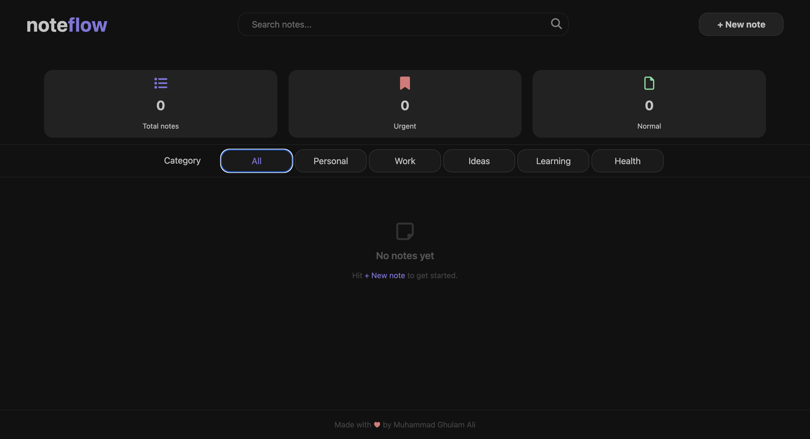

# noteflow 🗒️

A clean, minimal note-taking app built with **React** and **Vite** — featuring category filtering, priority tagging, and persistent local storage.



---

## ✨ Features

- **Create notes** with a title, description, category, and priority level
- **Search** notes in real time by title
- **Filter** by category — Personal, Work, Ideas, Learning, Health
- **Priority tagging** — Normal, Important, Urgent
- **Dashboard stats** — Total notes, Urgent count, and Important count at a glance
- **Persistent storage** — Notes survive page refreshes via `localStorage`
- **Delete notes** individually
- Fully **responsive** layout across mobile, tablet, and desktop

---


---

## 🚀 Getting Started

### Prerequisites

- Node.js `v18+`
- npm or yarn

### Installation

```bash
git clone https://github.com/your-username/noteflow.git
cd noteflow
npm install
npm run dev
```

Then open [http://localhost:5173](http://localhost:5173) in your browser.

---

## 🛠️ Tech Stack

| Tech | Purpose |
|------|---------|
| React 18 | UI & state management |
| Vite | Build tool & dev server |
| Tailwind CSS | Styling |
| Font Awesome | Icons |
| localStorage | Client-side persistence |

---

## 📁 Project Structure

```
noteflow/
├── public/
├── src/
│   ├── assets/         # Images / screenshots
│   ├── App.jsx         # Main app component
│   └── App.css
├── index.html
└── package.json
```

---

## 📌 Usage

1. Click **+ New note** to open the note creation panel
2. Fill in a title, description, category, and priority
3. Hit **Save note** — it's instantly saved and shown on the board
4. Use the **search bar** to find notes by title
5. Click a **category button** to filter the view
6. Hit **Delete** on any card to remove it

---

## 🤝 Contributing

Pull requests are welcome. For major changes, please open an issue first to discuss what you'd like to change.

---

## 👤 Author

**Muhammad Ghulam Ali**

---

## 📄 License

This project is open source and available under the [MIT License](LICENSE).# noteflow
